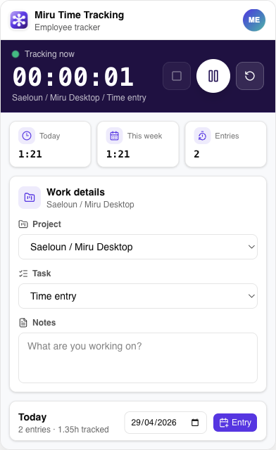
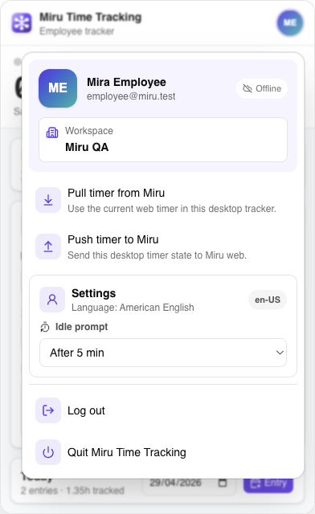
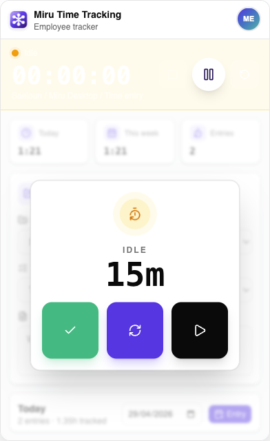

# Miru Time Tracking

Miru Time Tracking is a local-first macOS menu bar app for employees who need a fast, focused way to track work in Miru. It keeps the timer visible in the system menu bar, opens into a compact desktop tracker, and syncs the current timer with Miru web when an account is connected.

Built from [`LuanRoger/electron-shadcn`](https://github.com/LuanRoger/electron-shadcn) with Electron Forge, Vite, React, TypeScript, Tailwind, TanStack Router, Vitest, and Playwright.

Miru Time Tracking is MIT-licensed software.

- Miru web app: <https://app.miru.so>
- Miru product site: <https://miru.so>
- Miru web source: <https://github.com/saeloun/miru-web>
- Desktop source: <https://github.com/vipulnsward/miru-time-desktop>

## Screenshots

<p align="center">
  
  
  
</p>

## Highlights

- **Native macOS menu bar timer** with a stable-width time label and stateful tray icon colors for ready, running, paused, and idle.
- **Compact time tracker window** positioned below the menu bar, with high-contrast timer controls and a Miru-styled command surface.
- **Local-first tracking** through renderer local storage plus persisted Electron `userData` timer state, so the timer survives app relaunches.
- **Miru account bridge** for login, signup handoff, logout, workspace switching, current timer pull/push, and saving, editing, or deleting time entries.
- **Current timer sync** with Miru web through `GET/PUT /api/v1/desktop/current_timer`.
- **Idle recovery** with a custom in-app modal: trim and continue, trim and restart, or keep idle time.
- **Employee-focused UI** with no billing, rates, invoice, admin, or dashboard surfaces.
- **Profile-aware settings** showing the Miru user avatar when available, workspace, sync status, idle threshold, and locale.
- **Miru locale support** that reads `user.locale` or user settings first, then falls back to stored/browser locale and English strings.
- **Integration coverage** for the desktop timer, tray title, idle recovery, persistence, account menu behavior, and locale rendering.

## Product Shape

The app intentionally behaves like a small desktop utility, not a full web dashboard.

- The first screen is login/signup when no Miru session exists.
- The primary surface is the timer, project/task notes, summary, and timesheet entries.
- Account and sync controls live in a focused popover from the profile button.
- The tray icon carries state visually; the tray title stays width-stable to avoid menu bar jitter.

## Local Development

```bash
npm install
npm run start
```

The app opens an Electron window and creates a macOS menu bar item. During normal development it stores app data in Electron `userData`.

## Miru Web Connection

Production builds connect to Miru web at `https://app.miru.so` by default and do not show a Miru URL field in the sign-in flow.

Useful development overrides:

```bash
MIRU_API_BASE_URL=http://127.0.0.1:3000 npm run start
MIRU_SHOW_BASE_URL_FIELD=true npm run start
MIRU_ALLOW_BASE_URL_OVERRIDE=true npm run start
```

`MIRU_API_BASE_URL` changes the default API host. `MIRU_SHOW_BASE_URL_FIELD` exposes the sign-in URL field. `MIRU_ALLOW_BASE_URL_OVERRIDE` lets the main process honor stored or submitted custom hosts.

## Build From Source

Use Node 24, matching CI.

```bash
npm ci
npm run check
npm run test
npm run package
```

`npm run package` creates an unpacked macOS app under `out/`. `npm run make` creates distributable release artifacts under `out/make/`.

## Verification

```bash
npm run test
npm run test:e2e
npm run package
```

Useful full release check:

```bash
npm run test
npm run test:e2e
npm run make
```

The Playwright Electron specs launch the packaged app in a temporary profile so tests do not touch your real timer or Miru session.

## Package and Install Locally

Package the macOS app:

```bash
npm run package
```

Open the packaged app:

```bash
open "out/Miru Time Tracking-darwin-arm64/Miru Time Tracking.app"
```

Install it into `/Applications`:

```bash
ditto "out/Miru Time Tracking-darwin-arm64/Miru Time Tracking.app" "/Applications/Miru Time Tracking.app"
open "/Applications/Miru Time Tracking.app"
```

Build a distributable ZIP:

```bash
npm run make
```

The ZIP is generated under:

```text
out/make/zip/darwin/arm64/
```

## Miru Sync

Renderer calls are exposed through `window.miruApi`:

- `login`, `signup`, `logout`
- `switchWorkspace`
- `syncCurrentTimer("pull" | "push")`
- `saveTimerEntry`, `updateTimerEntry`, `deleteTimerEntry`

The main process owns API calls, local account persistence, timer persistence, tray updates, and offline fallback. Email/password login completes a desktop session today. Signup returns users to the login form after Miru creates the account, and Google opens Miru web sign-in until Miru web exposes a native desktop token callback. See [Sync strategy](docs/sync-strategy.md) for the API contract and conflict rules.

## Testing Scope

See [Integration specs](docs/integration-specs.md) for the current e2e coverage.

Covered flows include:

- Signed-out onboarding.
- Shared desktop timer behind the renderer.
- Native tray title and icon state.
- Idle recovery actions.
- Timer context persistence across relaunch.
- Account menu close/logout behavior.
- Miru user locale rendering.

## Release Prep

1. Run `npm run test`.
2. Run `npm run test:e2e`.
3. Run `npm run make`.
4. Open the packaged app and confirm the Miru icon, tray timer, account popover, and idle modal render correctly.
5. Publish the generated ZIP manually or run `npm run publish` when ready for a draft GitHub release.

Additional release notes live in [Release checklist](docs/release.md).

## Docs

- [Build and compile guide](docs/building.md)
- [Sync strategy](docs/sync-strategy.md)
- [Integration specs](docs/integration-specs.md)
- [Release checklist](docs/release.md)
